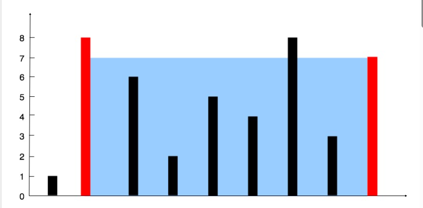

You are given an integer array height of length n.
There are n vertical lines drawn such that 
   the two endpoints of the ith line are (i, 0) and (i, height[i]).
Find two lines that together with the x-axis form a container, 
such that the container contains the most water.
Return the maximum amount of water a container can store.
Notice that you may not slant the container.

给定一个长度为 n 的整数数组 height 。有 n 条垂线，第 i 条线的两个端点是 (i, 0) 和 (i, height[i]) 
找出其中的两条线，使得它们与 x 轴共同构成的容器可以容纳最多的水
返回容器可以储存的最大水量
说明：你不能倾斜容器

Example 1:
    Input: height = [1,8,6,2,5,4,8,3,7]
    Output: 49

    Explanation: The above vertical lines are represented by array [1,8,6,2,5,4,8,3,7].
    In this case, the max area of water (blue section) the container can contain is 49.

Example 2:
    Input: height = [1,1]
    Output: 1
 
Constraints:
    n == height.length
    2 <= n <= 105
    0 <= height[i] <= 104