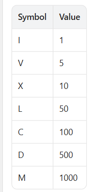
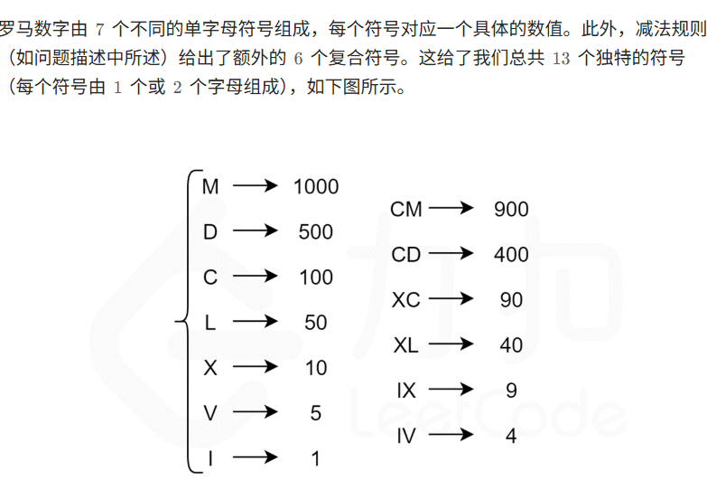

Seven different symbols represent Roman numerals with the following values:
七个不同的符号代表罗马数字，其值如下：

Roman numerals are formed by appending the conversions of decimal place values from highest 
    to lowest. Converting a decimal place value into a Roman numeral has the following rules:
If the value does not start with 4 or 9, 
select the symbol of the maximal value that can be subtracted from the input, 
append that symbol to the result, subtract its value, and convert the remainder to a Roman numeral.

If the value starts with 4 or 9 use the subtractive form representing one symbol subtracted from 
  the following symbol, for example, 4 is 1 (I) less than 5 (V): IV and 9 is 1 (I) 
  less than 10 (X): IX. Only the following subtractive forms are used: 4 (IV), 9 (IX), 
   40 (XL), 90 (XC), 400 (CD) and 900 (CM).

Only powers of 10 (I, X, C, M) can be appended consecutively at most 3 times to 
represent multiples of 10. You cannot append 5 (V), 50 (L), or 500 (D) multiple times. 
If you need to append a symbol 4 times use the subtractive form.
Given an integer, convert it to a Roman numeral.

罗马数字是通过添加从最高到最低的小数位值的转换而形成的。将小数位值转换为罗马数字有以下规则：
如果该值不是以 4 或 9 开头，请选择可以从输入中减去的最大值的符号，将该符号附加到结果，减去其值，
然后将其余部分转换为罗马数字。
如果该值以 4 或 9 开头，使用 减法形式，表示从以下符号中减去一个符号，例如 4 是 5 (V) 减 1 (I): IV ，
9 是 10 (X) 减 1 (I)：IX。仅使用以下减法形式：4 (IV)，9 (IX)，40 (XL)，90 (XC)，400 (CD) 和 900 (CM)。
只有 10 的次方（I, X, C, M）最多可以连续附加 3 次以代表 10 的倍数。你不能多次附加 5 (V)，50 (L) 或 500 (D)。
如果需要将符号附加4次，请使用 减法形式。
给定一个整数，将其转换为罗马数字。

Example 1:
    Input: num = 3749
    Output: "MMMDCCXLIX"
Explanation:
    3000 = MMM as 1000 (M) + 1000 (M) + 1000 (M)
     700 = DCC as 500 (D) + 100 (C) + 100 (C)
      40 = XL as 10 (X) less of 50 (L)
       9 = IX as 1 (I) less of 10 (X)
    Note: 49 is not 1 (I) less of 50 (L) because the conversion is based on decimal places

Example 2:
    Input: num = 58
    Output: "LVIII"
Explanation:
    50 = L
     8 = VIII

Example 3:
    Input: num = 1994
    Output: "MCMXCIV"
Explanation:
    1000 = M
     900 = CM
      90 = XC
       4 = IV

Constraints:
    1 <= num <= 3999