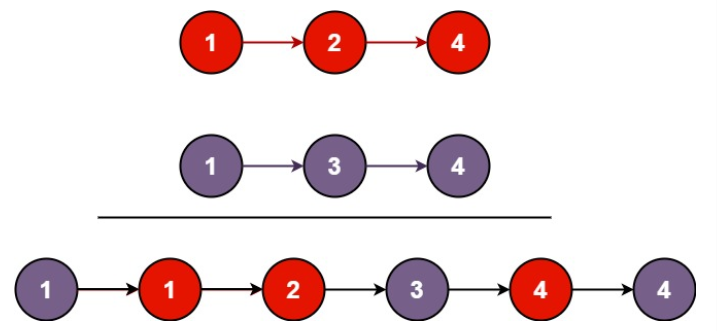

You are given the heads of two sorted linked lists list1 and list2.

Merge the two lists into one sorted list. 
The list should be made by splicing together the nodes of the first two lists.

Return the head of the merged linked list.
将两个升序链表合并为一个新的 升序 链表并返回。新链表是通过拼接给定的两个链表的所有节点组成的。 

Example 1:

    Input: list1 = [1,2,4], list2 = [1,3,4]
    Output: [1,1,2,3,4,4]

Example 2:
    Input: list1 = [], list2 = []
    Output: []

Example 3:
    Input: list1 = [], list2 = [0]
    Output: [0]
     

Constraints:
    The number of nodes in both lists is in the range [0, 50].
    -100 <= Node.val <= 100
    Both list1 and list2 are sorted in non-decreasing order.

提示：
    两个链表的节点数目范围是 [0, 50]
    -100 <= Node.val <= 100
    l1 和 l2 均按 非递减顺序 排列