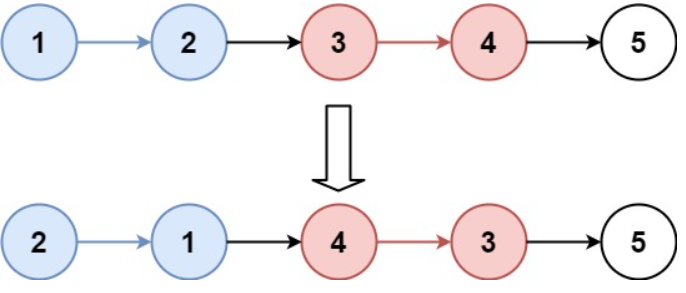
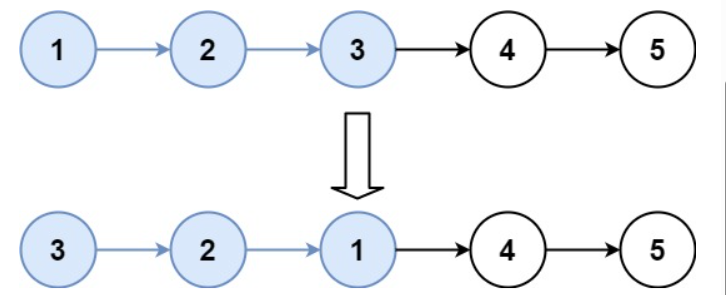

Given the head of a linked list, reverse the nodes of the list k at a time, and return the modified list.
k is a positive integer and is less than or equal to the length of the linked list. 
If the number of nodes is not a multiple of k then left-out nodes, in the end, should remain as it is.
You may not alter the values in the list's nodes, only nodes themselves may be changed.

给你链表的头节点 head ，每 k 个节点一组进行翻转，请你返回修改后的链表。
k 是一个正整数，它的值小于或等于链表的长度。如果节点总数不是 k 的整数倍，那么请将最后剩余的节点保持原有顺序。
你不能只是单纯的改变节点内部的值，而是需要实际进行节点交换。

Example 1:
    Input: head = [1,2,3,4,5], k = 2
    Output: [2,1,4,3,5]

Example 2:
    Input: head = [1,2,3,4,5], k = 3
    Output: [3,2,1,4,5]

 
Constraints:
    The number of nodes in the list is n.
    1 <= k <= n <= 5000
    0 <= Node.val <= 1000

Follow-up: Can you solve the problem in O(1) extra memory space?
